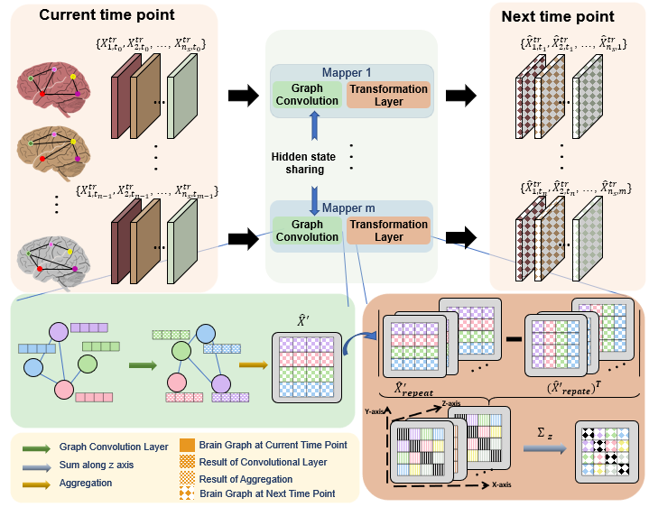
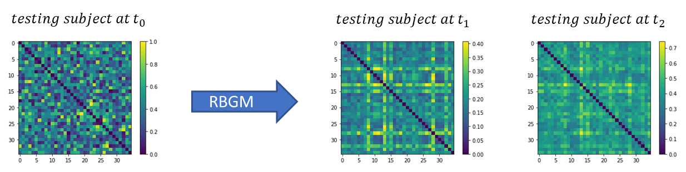

# Recurrent Brain Graph Mapper
How to predict the evolution trajectory of brain graphs with a single observation?
 
Please contact alptknheat@gmail.com for inquiries. Thanks.



# Introduction
This work is accepted at the MICCAI 2020 conference (early accept), Strasbourg, France.
> **Recurrent Brain Graph Mapper: A Geometric Deep Learning Framework to Predict Brain Graph Evolution.**
> Alpay Tekin, Ahmed Nebli, and Islem Rekik
> 
> BASIRA Lab, Faculty of Computer and Informatics, Istanbul Technical University, Istanbul, Turkey
> 
> **Abstract:** *Many brain disorders can be detected by observing alterations in the brain structural and functional connectivities. 
Hence, diagnosing neurological disorders such as dementia at an early stage is mandatory to prevent and reverse long-term damage in patients. 
Recent studies aimed to predict the evolution of brain anatomy over time by proposing models that work on brain images ignoring its interconnectedness as a complex system. Since brain connectivities can be easily seen as a graph connecting different regions, here, we present Recurrent Brain Graph Mapper (RBGM), the first edge-based recurrent graph neural network that predicts the time-dependent evaluation trajectory of a brain graph from a single baseline. Our RBGM contains a set of recurrent neural network mappers for each time point where each mapper aims to project the ground-truth brain graph onto its next time point. We leverage the teacher forcing method to boost training and improve the evolved brain graph quality. To maintain the topological consistency between the predicted brain graphs and their corresponding ground-truth brain graphs at each time point, we further integrate a topological loss. We also use l1 loss to capture time-dependency and minimize the distance between the brain graph at consecutive time points for regularization. Benchmarks against several variants of RBGM and the state-of-the-art methods prove that we can achieve the same accuracy in predicting brain graph evolution thanks to our simple yet highly efficient architecture and training strategy.*


## Code
This code was implemented using Python 3.8 (Anaconda) on Windows 10.


## Installation
### *Anaconda Installattion*
* Go to  https://www.anaconda.com/products/individual
* Download version for your system (We used Python 3.8  on 64bit Windows 10 )
* Install the platform
* Create a conda environment by typing:  ```conda create –n rbgm pip python=3.8 ```

### *Dependency Installation*
```sh
$ conda activate rbgm
$ pip install numpy 
$ pip install scikit-learn
$ pip install matplotlib 
$ conda install pytorch torchvision torchaudio cudatoolkit=10.2 –c pytorch 
$ pip install torch-scatter -f https://pytorch-geometric.com/whl/torch-latest+cu102.html
$ pip install torch-sparse -f https://pytorch-geometric.com/whl/torch-latest+cu102.html
$ pip install torch-cluster -f https://pytorch-geometric.com/whl/torch-latest+cu102.html
$ pip install torch-spline-conv -f https://pytorch-geometric.com/whl/torch-latest+cu102.html
$ pip install torch-geometric 
```
## Data Format
We represent each brain graph as a symmetric connectivity matrix therefore our model expects you to provide the path of matrices saved as a text file[#Subjects, #Nodes, #Nodes]. You can run the create_data.py to create data. If you want to use your dataset, 
you should put your data into the data folder and adjust the paths in data_utils.py accordingly.

## Run RBGM
To run our code, open up a terminal at RBGM’s directory and type in conda activate rbgm & python main.py

## Components of RBGM's code
| Component | Content |
| ------ | ------ |
| data_utils.py | It reads and converts the data into the desired format so that RBGM can process the data. |
| model.py | Implementation of the model.|
| main.py | Driver code that import variables from data_utils.py and trains RBGM (cross-validation). |
| plot.py | It creates plots of losses during the training and t-SNE plots during the testing.|
| create_data.py | It creates the simulated dataset. |
| results/ | After the testing, this folder contains MAE losses in t1 and t2 for each subject. |
| data/ | Contains generated data after compiling create_data.py |
| tsne/ | Contains tsne results for testing. |
| plots/ | Contains plots for MAE losses, topological losses, and total losses in training. |

## Example Results 

The figure demonstrates an example of output for 113 subjects. Each subject has 3 different time points 
(each represented by 35 by 35 matrix). Our code takes in a NumPy array of size [113, 3, 35, 35] and outputs a 35 by 35 matrix for each time point.

## YouTube videos to install and run the code and understand how RBGM works

To install and run DGN, check the following YouTube video: 

url to youtube github code video

To learn about how DGN works, check the following YouTube video: 

url to youtube project video

## RBGM on arXiv

arxiv url 
